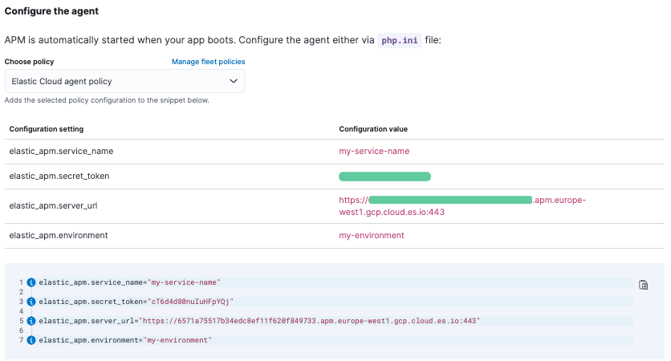

# Laboratorio elastic PHP agent con Wordpress
Lab para desplegar Wordpress con el Agente de APM para PHP de Elasticsearch 

## Prerequisitos
Crear una cuenta en [cloud.elastic.co](https://cloud.elastic.co) o _disponer / desplegar_ un entorno de Elasticsearch con [APM server](https://www.elastic.co/guide/en/apm/guide/current/apm-overview.html)

## Importante
Este laboratorio desplegará un Wordpress y MariaDB mediante Docker-compose, para montar un laboratorio con Docker y Docker-compose así como la infraestructura necesaria esta fuera del alcance de esta demo, se aceptan sugerencias y peticiones.

El archivo docker-compose.yml creará los recursos necesarios incluyendo la persistencia de los datos mediante volúmenes de Docker.

```yml
version: '3.1'
services:
    wordpress:
        image: wordpress:latest
        links:
        - mariadb:mysql
        environment:
        - WORDPRESS_DB_PASSWORD=password
        - WORDPRESS_DB_USER=root
        ports:
        - 80:80
        volumes:
        - wordpress_data:/var/www/html
        - apm_data:/opt
        - php-config:/usr/local/etc/php
    mariadb:
        image: mariadb:latest
        environment:
        - MYSQL_ROOT_PASSWORD=password
        - MYSQL_DATABASE=wordpress
        volumes:
        - db_data:/var/lib/mysql

volumes:
  wordpress_data:
  db_data:
  apm_data:
  php-config:
```

El agente de PHP de Elasticsearch se puede bajar desde su Github [apm-agent-php](https://github.com/elastic/apm-agent-php/releases)

Aunque tambíen podemos compilar nuestra propia versión [Build from source](https://www.elastic.co/guide/en/apm/agent/php/current/setup.html#build-from-source):

 - [Descargar las fuentes de Github](https://github.com/elastic/apm-agent-php/)
 - Compiar
 ```bash
 cd apm-agent-php
# for linux glibc - libc distributions (Ubuntu, Redhat, etc)
export BUILD_ARCHITECTURE=linux-x86-64
# for linux with musl - libc distributions (Alpine)
export BUILD_ARCHITECTURE=linuxmusl-x86-64

# build extensions
make -f .ci/Makefile build

# run extension tests
PHP_CONFIG=php-config PHP_VERSION=`$PHP_CONFIG --version | cut -d'.' -f 1,2` make -f .ci/Makefile run-phpt-tests

# install
PHP_CONFIG=php-config sudo cp agent/native/_build/${BUILD_ARCHITECTURE}-release/ext/elastic_apm-`$PHP_CONFIG --phpapi`.so `$PHP_CONFIG --extension-dir`
 ```

Recrodar que necesitaremos los archivos `.so` y el `bootstrap_php_part.php` para usarlo mas adelante en la configuraicón del `php.ini`

Los archivos los encontrareis en `agent/native/_build/linux-x86-64-release/ext/` (__dependiende de vuestra plataforma claro !!!__)

```bash
# Adelanto
extension=elastic_apm.so
elastic_apm.bootstrap_php_part_file=<repo root>/agent/php/bootstrap_php_part.php
```

El archivo `elastic-apm.ini` que usaremos (el nombre es arbitrario) tiene este contenido:

```ini
extension=/opt/elastic/apm-agent-php/extensions/elastic_apm-20200930.so
elastic_apm.bootstrap_php_part_file=/opt/elastic/apm-agent-php/src/bootstrap_php_part.php
elastic_apm.ast_process_enabled = 0
elastic_apm.server_url=https://your.apm.server:8200
elastic_apm.secret_token=your.token
elastic_apm.service_name=your-service_name
elastic_apm.environment=your_environment
```
En este caso estoy usando al ruta por defecto en `/opt/` de la descompresión del agente bajado del Github, si queréis usar el compilado por vosotros tendréis que adaptarlo, al igual que el restro de parámetros



#Lanzar el laboratorio
```bash
# Levantar el entorno
docker-compose up -d

#verificar los logs
docker-compose -f logs

#copiar archivos al conteneder:
#copiar el algente
docker cp apm-agent-php-linux-x86-64.tar opt_wordpress_1:/opt
#copiar el archivo de configuración:
docker cp elastic-apm.ini opt_wordpress_1:/usr/local/etc/php/conf.d

#Entramos en el contenedor para descomprimir el agente:
docker exec -ti opt_wordpress_1 bash
cd /
tar -xvf /opt/apm-agent-php-linux-x86-64.tar
```

Si todo ha salido bien, ya podemos ejectuar `docker-compose restart` para que los nuevos archivos surtan efecto y podemos navegar a la IP del servidor puerto 80 he instalar Wordpress ya con el Agente de PHP de Elasticsearch instalado.


